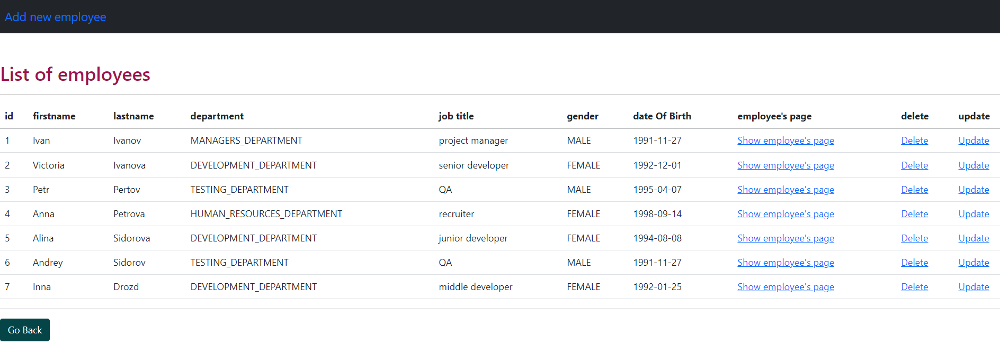
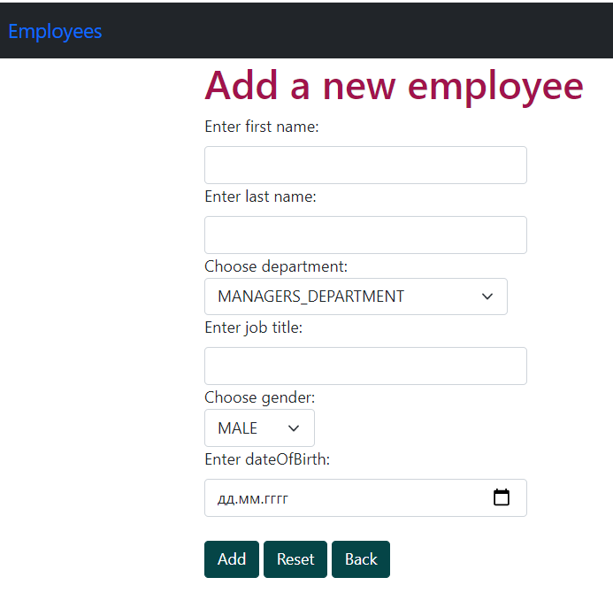
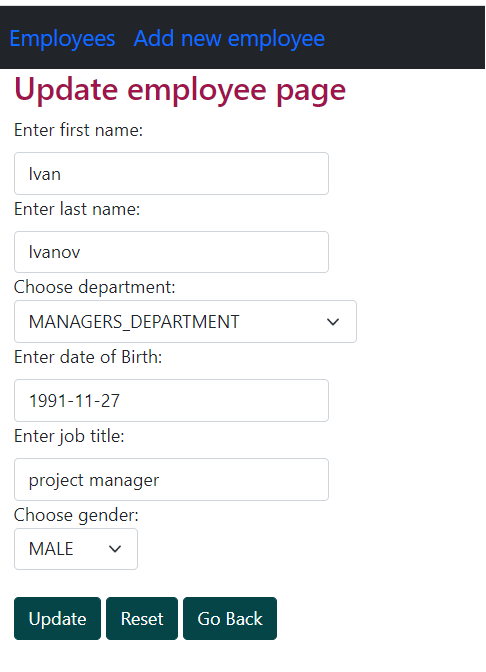

> Main_app is a simple application that includes a REST API and UI, which allows you to perform CRUD operations on an entity.

* [General information about the project ](#general-information-about-the-project)
* [Technologies ](#technologies)
* [How to build ](#how-to-build)
* [Screenshots ](#screenshots)

## General information about the project

### You can test the functionality of the application:
# REST
- to get all employees, send the following request: 'GET http://localhost:8080/api/employees'
- to delete employee by id, send the following request: 'DELETE http://localhost:8080/api/employees/{{id}}'
- Form and track user orders
- to add employee, send the following request: 'POST http://localhost:8080/api/employees' with Content-Type: application/json;
- to get employee by id, send the following request: 'GET http://localhost:8080/api/{{id}}
# UI
- To view the UI, just run the application

### Technologies
- Java 8
- Maven
- Spring Boot
- Spring MVC
- Spring JDBC
- Git
- Docker
- REST
- JSON
- HTML5
- Thymeleaf
- Log4j2
- Postgres
- Apache Pool
- Flyway
- Lombok
- JUnit5
- Mockito

### How to build

1. Build project: mvn clean install
2. To run environment: docker-compose up -d
3. To run the project: run 'Application.class' 

## Screenshots

